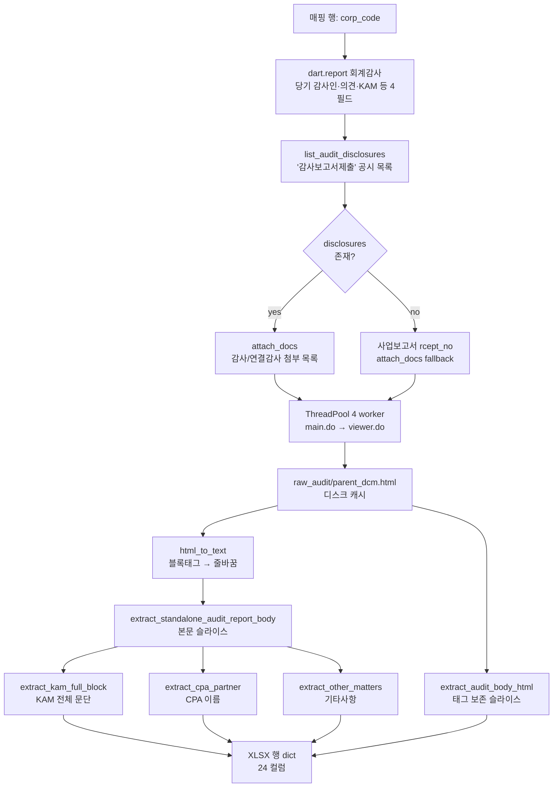

# DART 감사보고서 대시보드

OPENDART(전자공시) 에서 **코스피·코스닥 상장사 2025 사업연도 감사보고서**를 자동
수집·파싱하여 **검색 가능한 XLSX DB** 와 **Streamlit 대시보드** 로 제공하는 프로젝트.

- 🌐 라이브 대시보드: [dart-audit-report.streamlit.app](https://share.streamlit.io/) (배포 후)
- 📦 GitHub: <https://github.com/taesueocpa/dart_audit_report>
- 🗂 메인 산출물: `dashboard/data/audit_reports_full_v3.xlsx` (15 MB, **4,627 행 × 24 컬럼**)

---

## 1. 한눈에 보기

```
KRX 상장사 CSV (2,879종목)
  │
  ├─→ ① stock_to_corp     ─→ stock_to_corp.csv (종목코드 → DART 고유번호)
  │
  ├─→ ② OPENDART API ─────→ 회계감사 구조화 4필드 (회사당 1)
  │     accnutAdtorNmNdAdtOpinion
  │
  ├─→ ③ list.json ────────→ '감사보고서제출' 공시 목록 (자회사 제외)
  │
  ├─→ ④ attach_docs ──────→ 첨부 목록 (감사 / 연결감사)
  │
  ├─→ ⑤ main.do + viewer.do (4 worker 병렬)
  │     │
  │     └→ raw_audit/{parent}_{dcm}.html  ← 캐시 (4,624 파일, 영구 재사용)
  │
  ├─→ ⑥ html_to_text + 정규식 추출
  │     · 본문 슬라이스 (줄바꿈 보존)
  │     · KAM 전체 문단 / CPA / 기타사항
  │     · 본문 HTML 슬라이스 (서식 보존)
  │
  └─→ audit_reports_full_v3.xlsx (24 컬럼) ─→ Streamlit 대시보드
```

회사당 평균 **2초**, 전체 2,562 회사 처리 **~85 분** (캐시 hit 시 재실행 ~5분).

---

## 2. 리포지토리 구조

```
dart_audit_report/
├── ingest/                                 ← 데이터 수집·파싱 (Python)
│   ├── audit_xlsx/
│   │   ├── __main__.py / cli.py           # `python -m audit_xlsx ...` 진입
│   │   ├── settings.py                    # .env 로딩 + 경로
│   │   ├── stock_to_corp.py               # KRX CSV → DART corp_code 매핑
│   │   ├── fetch_audit.py                 # OPENDART API + viewer.do fetcher
│   │   ├── extractors.py                  # 본문/KAM/CPA 정규식 추출
│   │   ├── parse_audit.py                 # 회사당 N행 생성 (병렬화 + dedupe)
│   │   └── export_xlsx.py                 # dict → XLSX (Arial 폰트)
│   ├── reparse_from_cache.py              # API 0회 — 캐시만 재파싱 (1~2분)
│   └── pyproject.toml                     # opendartreader/openpyxl/pandas
│
├── dashboard/                              ← Streamlit 웹 대시보드
│   ├── app.py                              # 사이드바 + 메인 표 + 행 클릭 상세
│   ├── data_loader.py                      # @st.cache_data XLSX 로더
│   ├── filters.py                          # 사이드바 5종 필터 + 본문 키워드
│   ├── download.py                         # 필터 결과 → Excel bytes
│   ├── data/
│   │   └── audit_reports_full_v3.xlsx     # 15 MB, git tracking
│   ├── requirements.txt                    # streamlit/pandas/openpyxl
│   └── .streamlit/config.toml              # 라이트 테마
│
├── data/                                    ← .gitignore (로컬 캐시)
│   ├── stock_to_corp.csv                   # 2,562 회사 매핑
│   └── raw_audit/                          # 4,624개 viewer.do 캐시 HTML
│
├── market/                                  ← 입력 데이터 (사용자 배치)
│   └── data_2214_20260514.csv              # KRX 상장사 CSV (cp949)
│
├── env.sample                               # .env 템플릿 (DART_API_KEY)
└── README.md                                # 이 파일
```

---

## 3. 데이터 파이프라인 (`ingest/audit_xlsx`)

### 3-1. 모듈별 역할

| 파일 | 역할 |
|---|---|
| `settings.py` | `.env` 로드, 경로 설정 (`data/`, `raw_audit/`, mapping/output 파일) |
| `stock_to_corp.py` | `market/data_2214_20260514.csv` (KRX, cp949) → 종목코드 + DART corp_code 매핑 CSV. **OpenDartReader.find_corp_code** 사용 |
| `fetch_audit.py` | **3가지 OPENDART 호출**: <br>· `dart.report(corp, '회계감사', 2025, 11011)` → 구조화 4필드 (감사인/감사의견/KAM/강조사항)<br>· `list_audit_disclosures(corp_code)` → '감사보고서제출' 공시 목록 (자회사 제외)<br>· `dart.attach_docs(rcept_no, match='감사보고서')` → 첨부 (감사/연결감사) |
| `extractors.py` | **정규식 기반 추출** (순수 함수): <br>· `extract_standalone_audit_report_body` — 본문 슬라이스 (헤더 ~ 결구)<br>· `extract_kam_full_block` — KAM 전체 문단<br>· `extract_audit_body_html` — 원본 HTML 슬라이스 (서식 보존)<br>· `extract_cpa_partner` — 업무수행 공인회계사<br>· `extract_other_matters` — 기타사항<br>· `normalize_firm_name` — 회계법인 표기 정규화 |
| `parse_audit.py` | 매핑 회사 순회: 회사당 N행 (F001 감사 + F002 연결감사), `ThreadPoolExecutor(4)` 로 viewer fetch 병렬화, 정정공시 dedupe, raw HTML 디스크 캐시 |
| `export_xlsx.py` | dict → openpyxl (Arial 폰트, 헤더 컬러, 24 컬럼) |
| `cli.py` | `build-mapping` / `run` 서브커맨드 |

### 3-2. 핵심 흐름 (회사 1건 처리)



### 3-3. 추출 로직 핵심 정규식

#### (가) 본문 슬라이스 (`extract_standalone_audit_report_body`)
- **시작**: `독립된\s*감사인의\s*감사보고서[\s\S]{1,300}?주주\s*(?:및|,)\s*이사회\s*귀중`
  - "독립된 감사인의 감사보고서 [회사명] 주주 및 이사회 귀중" 표준 헤더
  - 목차에 단독 등장하는 케이스는 회사명+주주귀중이 안 따라오므로 자동 제외
- **끝** (가장 빠른 위치 채택):
  - 결구: `이\s*감사보고서가\s*수정될\s*수도\s*있습니다\.?` (결구 포함)
  - 첨부: `\(\s*첨\s*부\s*\)\s*재\s*무\s*제\s*표` (직전까지)

#### (나) KAM 전체 문단 (`extract_kam_full_block`)
- **시작**: `(?<![가-힣])(?:핵심\s*감사\s*사항|Key\s*Audit\s*Matters)(?![가-힣]|들)`
- **끝** (가장 빠른 위치 채택):
  1. 강조사항 절 헤더
  2. 기타사항 절 헤더
  3. "재무제표에 대한 경영진과 지배기구의 책임"
  4. "재무제표 감사에 대한 감사인의 책임"
  5. "독립된 감사인의 책임"
- **항목별 분리 X** — 헤더 ~ 다음 절 직전까지 한 덩어리 (사용자 요구)

#### (다) 회계법인 정규화 (`normalize_firm_name`)
- 변형 패턴 39종 → 51종 정규형
- 처리: 줄바꿈/공백 합침 → 괄호 부가설명 제거(`(구,…)`/`(PwC)`/`(주1)`/`(前…)`) → "회계법인" 뒤 추가정보 절단 → 한글 사이 공백 제거
- 예: `'삼정\n회계법인'` / `'대성회계법인\n(구, 대성삼경회계법인)'` / `'한 영 회 계 법 인'` → 모두 `'삼정회계법인'` / `'대성회계법인'` / `'한영회계법인'`

#### (라) HTML 본문 슬라이스 (`extract_audit_body_html`)
- raw HTML 그대로에서 시작/끝 마커 검색 (글자 사이 `\s*` 허용)
- 시작 = 두 번째 "독립된 감사인의 감사보고서" (첫 번째는 보통 목차)
- 끝 = 결구 / `(첨부)재무제표` 직전 → closing 태그까지 확장 (HTML 무결성)
- 결과: 평균 5.8KB, p95 8KB, 32K 한도 내

### 3-4. 우선순위 / Fallback

```
감사인(회계법인) : OPENDART API의 adtor (정규화 적용)
감사의견         : OPENDART API의 adt_opinion
강조사항         : OPENDART API의 emphs_matter (원본)
핵심감사사항(KAM): 본문 슬라이스 (extract_kam_full_block) ▶ API의 core_adt_matter
업무수행 CPA     : 본문 정규식 (extract_cpa_partner)
기타사항         : 본문 정규식 (extract_other_matters)
본문 전체 (평문)  : 본문 슬라이스 (줄바꿈 보존)
본문 (HTML)      : raw HTML 슬라이스 (태그·스타일 보존)
```

### 3-5. 핵심 디자인 결정

- **OPENDART API quirk 회피**: `pblntf_ty='F'` 와 `corp_code` 를 함께 보내면 0건이 옴.
  대신 `list.json` 을 kind 필터 없이 호출 후 `report_nm` 에서 "감사보고서" 키워드 필터링.
- **자회사 보고서 제외**: 지주회사가 자회사 감사보고서를 함께 공시하는 케이스
  (AK홀딩스 9건 등). `report_nm` 에 "자회사" / "종속회사" 키워드가 있으면 제외.
- **정정공시 dedupe**: 같은 `(corp_code, report_kind)` 그룹에 정정본이 있으면 정정본만,
  같은 등급이면 `parent_rcept_no` 가 큰 것 (= 시간순 후순위 = 최신).
- **multi-page tree fetch**: main.do 페이지에 sub-section tree가 있으면 (금비 등 6 sub)
  모든 sub viewer.do 합본. 단일 첨부면 onload viewDoc 인자로 viewer 한 개.
- **디스크 캐시**: `data/raw_audit/{parent}_{dcm}.html`. 5KB 미만은 표지만 받은 케이스로
  간주하고 무시(재fetch). 이후 재실행은 캐시 hit으로 매우 빠름.

---

## 4. 대시보드 (`dashboard/`)

### 4-1. 화면 구성

단일 페이지, 사이드바 필터 + 메인 표 + 행 클릭 시 본문 expander.

```
┌─────────────────────────────────────────────────────────────┐
│ [사이드바]                                                    │
│  · 시장구분 (KOSPI/KOSDAQ/KOSDAQ GLOBAL)                       │
│  · 감사의견 (적정/한정/부적정/의견거절)                          │
│  · 보고서 종류 (감사/연결감사)                                  │
│  · 감사인 (51종, 검색 가능)                                     │
│  · 회사명/종목코드 [텍스트]                                     │
│  · ──── 본문 키워드 [텍스트] ─ KAM/강조/기타/본문 통합 검색      │
│  · 필터 결과: N / 4,627 행                                      │
└─────────────────────────────────────────────────────────────┘
┌─────────────────────────────────────────────────────────────┐
│ 📊 DART 감사보고서 대시보드                                    │
│ [📥 Excel 다운로드] [본문 포함 ☐]                              │
│                                                              │
│  ┌─────────────────────────────────────────────────────┐     │
│  │ 회사명 │ 시장 │ 의견 │ 감사인 │ CPA │ … │ 본문 길이   │ ←표 │
│  └─────────────────────────────────────────────────────┘     │
│                                                              │
│  ─── 행 클릭 시 ───                                           │
│  📄 [회사명] · 메타 정보                                       │
│  ▼ 핵심감사사항(본문)                                          │
│  ▼ 강조사항                                                   │
│  ▼ 기타사항                                                   │
│  ▼ 감사보고서 본문 전체 (기본 펼침)                            │
│     └─ HTML 본문 (iframe, 표·문단·스타일 그대로) [Recommended]│
│     └─ ▼ 평문 버전 (줄바꿈만) — fallback expander              │
└─────────────────────────────────────────────────────────────┘
```

### 4-2. 핵심 기능

| 기능 | 구현 |
|---|---|
| 필터 (5종 + 본문 키워드) | `filters.render_sidebar()` — boolean mask 반환 |
| 표 | `st.dataframe(on_select="rerun", selection_mode="single-row")` |
| 행 클릭 상세 | `event.selection.rows` 기반 expander 4개 |
| HTML 서식 보존 본문 | `st.html(row['감사보고서 본문(HTML)'])` (iframe 격리) |
| Excel 다운로드 | `pd.ExcelWriter → BytesIO → st.download_button` (본문 포함/제외 토글) |
| 캐싱 | `@st.cache_data` (XLSX 로드 + Excel bytes 생성) |

### 4-3. 호스팅

- **Streamlit Cloud** (https://share.streamlit.io) — GitHub repo 연결, `dashboard/app.py` entry
- 데이터 갱신: 파이프라인 재실행 → `cp data/audit_reports_full_v3.xlsx dashboard/data/` → git push → 자동 재배포

---

## 5. XLSX 스키마 (24 컬럼, 4,627 행)

| # | 컬럼 | 출처 | 비고 |
|---|---|---|---|
| 1 | 종목코드 | KRX CSV | 6자리 단축코드 |
| 2 | DART고유번호 | OpenDartReader | 8자리 |
| 3 | 회사명 | KRX 또는 API | 한글 종목약명 |
| 4 | 시장구분 | KRX CSV | KOSPI/KOSDAQ/KOSDAQ GLOBAL |
| 5 | 보고서 종류 | 첨부 제목 분류 | 감사보고서 / 연결감사보고서 |
| 6 | 첨부 제목 | attach_docs | "2026.03.19 감사보고서" 등 |
| 7 | 감사보고서제출 접수번호 | list.json | "감사보고서제출" 공시 rcept_no |
| 8 | 사업보고서 접수번호 | API | accnutAdtorNmNdAdtOpinion 응답 |
| 9 | 결산기준일 | API | "2025-12-31" 등 |
| 10 | 사업연도 | API | "당기 2025년 12월 31일" |
| 11 | **감사의견** | API | 적정의견(4,457) / 의견거절(91) / 한정의견(6) |
| 12 | **감사인(회계법인)** | API + 정규화 | 51종 정규형 (삼일/삼정/한영 …) |
| 13 | 핵심감사사항(KAM) | API | OPENDART 원천 |
| 14 | **핵심감사사항(본문)** | 본문 정규식 ▶ API fallback | **98.6%** 보유 |
| 15 | 강조사항 | API | EOM (Emphasis of Matter) |
| 16 | 기타사항 | 본문 정규식 | Other Matters |
| 17 | 업무수행 공인회계사 | 본문 정규식 | "박원현" 등 |
| 18 | **감사보고서 본문 전체** | 본문 슬라이스 (줄바꿈) | 평균 4.4KB |
| 19 | **감사보고서 본문(HTML)** | raw HTML 슬라이스 | **99.7%** 보유, 평균 5.8KB |
| 20-22 | (길이 메타) | — | 원문/평문/슬라이스 길이 |
| 23 | 스킵 사유 | — | `no_body_match` / `no_attachments` 등 |
| 24 | 파싱 오류 | — | 예외 메시지 (있을 시) |

### 추출률

| 컬럼 | 추출률 |
|---|---|
| 감사의견 / 감사인 | **100% (4,624/4,627)** |
| 본문 슬라이스 | **99.5% (4,602)** |
| 본문 HTML | **99.7% (4,612)** |
| KAM (본문 + API fallback) | **98.6% (4,562)** |
| CPA | **94.8%** |
| 강조사항 | 65.6% |
| 기타사항 | 29.6% |

---

## 6. 사용법

### 6-1. 사전 준비

```powershell
# 1) 의존성 설치
cd ingest
pip install -e .         # opendartreader, openpyxl, pandas, lxml, requests

cd ../dashboard
pip install -r requirements.txt   # streamlit, pandas, openpyxl

# 2) OPENDART API 키 발급 → 프로젝트 루트에 .env
DART_API_KEY=발급받은_40자리_키

# 3) 입력 CSV 배치
market/data_2214_20260514.csv     # KRX 상장사 (cp949)
```

### 6-2. 데이터 수집 (처음 1회)

```powershell
# 매핑 CSV 생성 (~2분, 2,562 회사)
python -m audit_xlsx build-mapping

# 전체 파이프라인 — 약 85분 (회사당 2초, 4 worker 병렬)
python -m audit_xlsx run --save-raw

# 결과: data/audit_reports_full.xlsx + data/raw_audit/*.html (4,624개)
```

### 6-3. 캐시 재파싱 (코드 수정 후)

```powershell
# API 0회 호출 — 캐시만 다시 평문화/슬라이스/추출 (~1-2분)
python ingest/reparse_from_cache.py
# 결과: dashboard/data/audit_reports_full_v3.xlsx
```

### 6-4. 대시보드 실행

```powershell
cd dashboard
streamlit run app.py
# → http://localhost:8501
```

---

## 7. 환경 / 의존성

- **Python 3.11+** (3.14 테스트)
- **opendartreader 0.3.0** — OPENDART API wrapper
- **openpyxl 3.1+** — XLSX 입출력
- **pandas 2.0+** — DataFrame
- **streamlit 1.39+** — 대시보드 (`st.html` API 사용)
- **requests 2.31+** — HTTP

OPENDART API 한도: 일일 20,000 호출. 전체 2,562 회사 처리에 약 7,700 호출 사용.

---

## 8. 면책 / 한계

- 모든 추출은 OPENDART 원천 데이터 + 정규식 휴리스틱 혼합. **법적·회계적 판단을 대체하지 않음**
- 잔여 미추출 65건은 의견거절 보고서 등 KAM 자체가 없는 회사 (87%가 의견거절)
- 본문 HTML 슬라이스 32K(Excel 한도) 초과 시 truncate (1건 미만)
- 정규식 매칭 한계로 비표준 형식 보고서 일부 (~0.3%) 본문 추출 실패
- 데이터 갱신은 **수동** — 파이프라인 재실행 + git push 필요

---

## 9. 마일스톤 / 변경 이력

| 커밋 | 내용 |
|---|---|
| `23da58a` | 초기 SQLite + Next.js 대시보드 (이후 폐기) |
| `80f309a` | dart_kam SQLite 흐름 → audit_xlsx 패키지 전환 |
| `4834cfb` | 감사인 정규화 + 자회사 제외 + multi-page fetch 보강 |
| `16265c4` | Streamlit 대시보드 추가 (요약/표/검색 탭) |
| `2475841` | 차트·탭 제거, 표 + 본문 단일 페이지로 단순화 |
| `f8dda0f` | 본문 줄바꿈 보존 + KAM 본문 추출 |
| `f4c549e` | KAM 끝 마커에 강조사항 추가 + API fallback (98.6%) |
| `c5ff3bb` | 본문 HTML 슬라이스 — `st.html` 로 원본 서식 보존 |

---

## 10. 라이선스 / 출처

- 데이터 출처: 금융감독원 전자공시시스템 (OPENDART) <https://opendart.fss.or.kr>
- 라이브러리: [OpenDartReader](https://github.com/FinanceData/OpenDartReader) (FinanceData)
- 본 저장소는 학습/연구 목적의 개인 프로젝트입니다.
